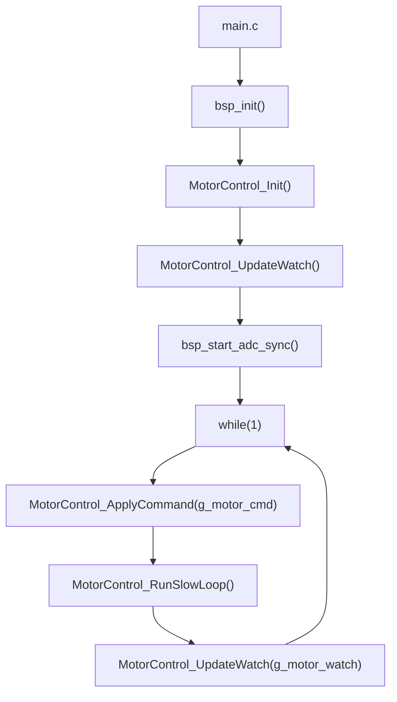
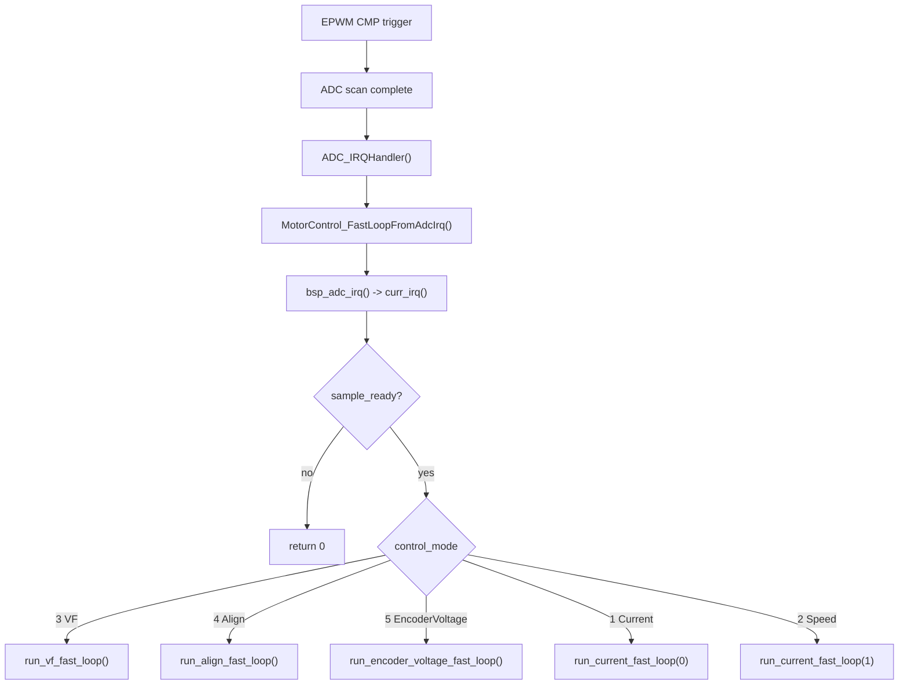
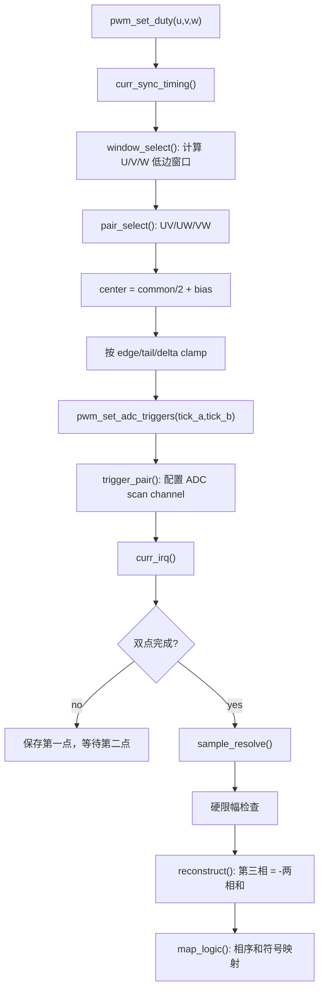
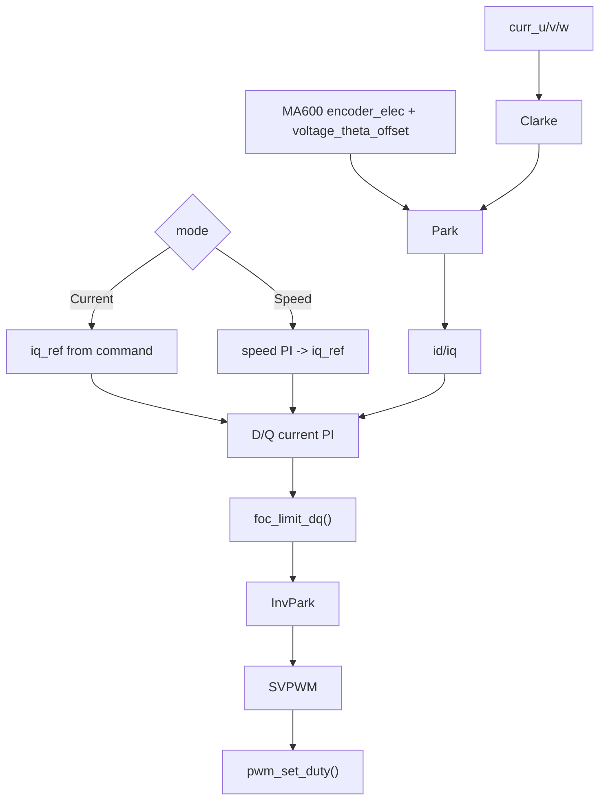

# Active Control Chain

本文记录当前 `cms32foc` 主固件的真实控制链路。当前工程处在纯 C bring-up 阶段，C++ 控制层只保留为历史架构参考，不参与 `cms32foc` 的运行路径。

当前有效链接边界：

```text
cms32foc -> cms32_motor_control_c -> cms32_bsp + cms32_foc_algorithm
```

## 启动与主循环



主循环只负责命令复制、慢速状态检查和 Ozone watch 刷新。真正的电流采样和 FOC 快环在 ADC 中断里跑。

## ADC 快环



`curr_irq()` 只有在双点采样已经完成并解析出新电流后才返回 ready。速度环和电流环不会在主循环里直接更新 PWM。

## 电流采样链路

当前保留的采样基线是两相采样加 KCL 重构：

下一版采样规划见 `Docs/Architecture/CurrentSamplingPlan.md`。它将当前固定/半动态 pair 方案升级为 ignore-shunt 风格：每拍判断 U/V/W 低边窗口，选择有效两相采样，第三相重构，无效窗口保持或拒收。



已删除的实验路径：三电阻顺序扫描诊断、自适应边沿裕量、时序预测/IIR、KCL 软修正。现在采样层不再用这些路径修改控制电流，避免把诊断和滤波行为混入 dq。

## Current 和 Speed



`control_mode = 1` 使用命令里的 `id_ref/iq_ref`。`control_mode = 2` 先用速度 PI 生成 `iq_ref`，再走同一套电流环。电流环输出的 `vd/vq` 和 VF 开环里的 `vf_voltage` 都是同一套 SVPWM 电压 count 量纲，但来源不同。

## Ozone 观察入口

常用命令变量：

| 字段 | 用途 |
| --- | --- |
| `g_motor_cmd.enable` | 使能控制链路 |
| `g_motor_cmd.control_mode` | `1` Current, `2` Speed, `3` VF, `4` Align, `5` EncoderVoltage |
| `g_motor_cmd.id_ref/iq_ref` | 电流环给定 |
| `g_motor_cmd.speed_ref_rpm` | 速度环 rpm 给定入口 |
| `g_motor_cmd.elec_zero_trim` | 电角度零位临时 trim |
| `g_motor_cmd.voltage_theta_offset` | 动态相位提前诊断 offset |

常用观察变量：

| 字段 | 重点 |
| --- | --- |
| `iu_cnt/iv_cnt/iw_cnt`, `i_sum` | 三相电流和 KCL 重构结果 |
| `id/iq`, `id_ref/iq_ref` | dq 投影和电流环跟随 |
| `vd/vq`, `v_limited` | 电流环输出电压及限幅 |
| `duty_u/duty_v/duty_w` | SVPWM 输出 |
| `sample_pair` | 当前采样的两相组合，`0=UV`, `1=UW`, `2=VW` |
| `sample_common_window` | 当前 pair 的共同低边采样窗口 |
| `sample_tick_a/b` | 实际 ADC 触发点 |
| `sample_spread0/1` | 同窗口双点差值 |
| `iv_spike_count/iw_spike_count` | 相邻采样尖峰计数 |

旧的 `sample_three_shunt` 和 `sample_meas_*` 字段已经从当前 watch 中移除。Ozone 重新加载 ELF 后需要删除旧 watch 项，再按上表添加当前字段。
