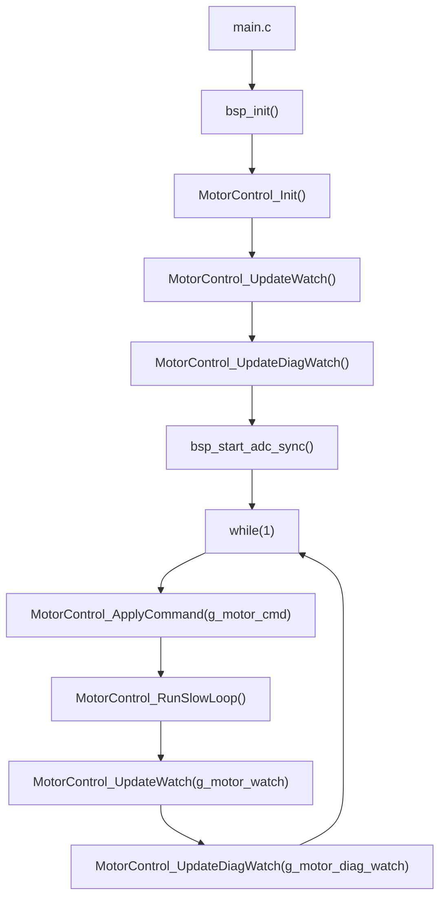
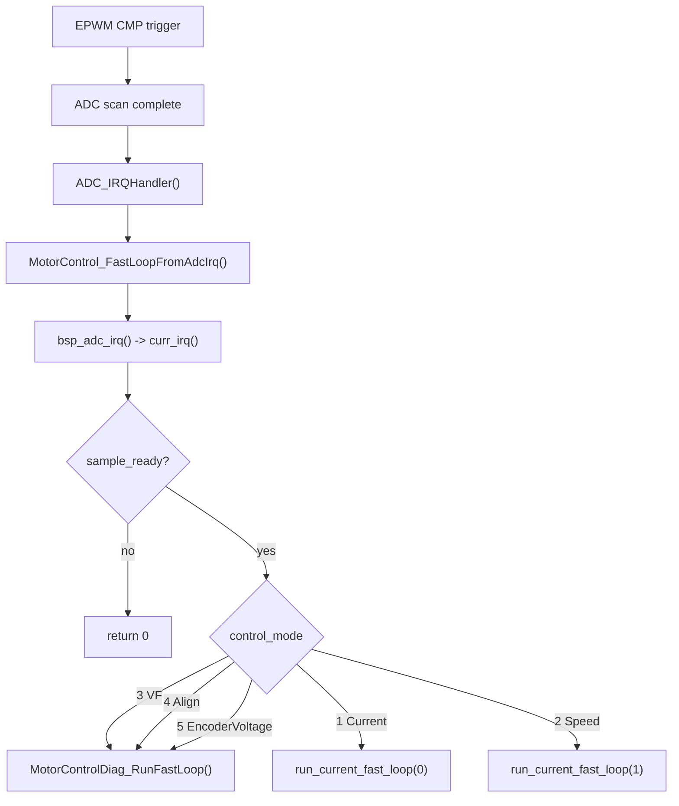
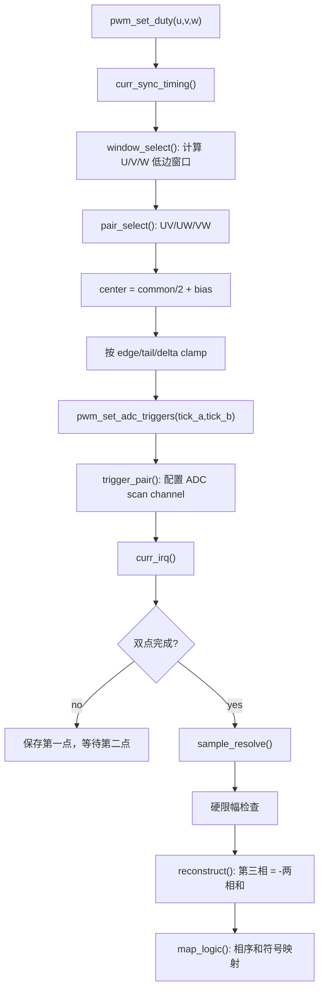
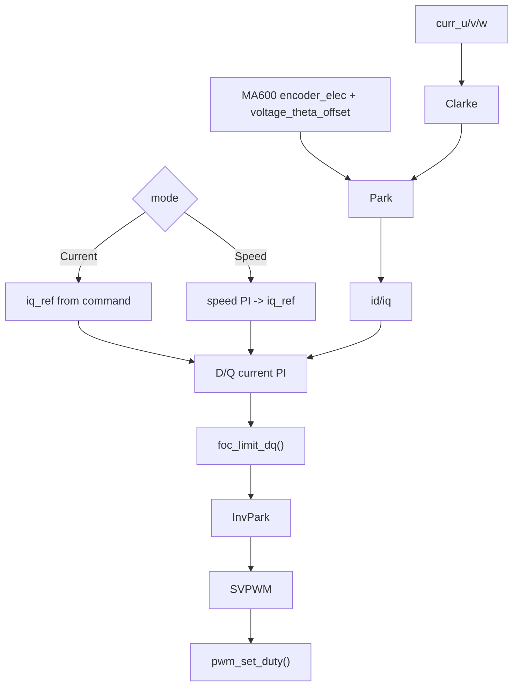

# Active Control Chain

本文记录当前 `cms32foc` 主固件的真实控制链路。当前工程处在纯 C bring-up 阶段，C++ 控制层只保留为历史架构参考，不参与 `cms32foc` 的运行路径。

当前有效链接边界：

```text
cms32foc -> cms32_motor_control_c -> cms32_bsp + cms32_foc_algorithm
```

## 启动与主循环



主循环只负责命令复制、慢速状态检查和 Ozone watch 刷新。真正的电流采样和 FOC 快环在 ADC 中断里跑。

## ADC 快环



`curr_irq()` 只有在双点采样已经完成并解析出新电流后才返回 ready。速度环和电流环不会在主循环里直接更新 PWM。`control_mode = 3/4/5` 已经隔离到 `motor_control_diag.c`，主控制文件只直接实现 Current/Speed；诊断模式仍复用主线的电流检查、编码器基础更新和电压输出 helper。

## 电流采样链路

当前保留的采样基线是两相采样加 KCL 重构：

下一版采样规划见 `Docs/Architecture/CurrentSamplingPlan.md`。它将当前固定/半动态 pair 方案升级为 ignore-shunt 风格：每拍判断 U/V/W 低边窗口，选择有效两相采样，第三相重构，无效窗口保持或拒收。



已删除的实验路径：三电阻顺序扫描诊断、自适应边沿裕量、时序预测/IIR、KCL 软修正。现在采样层不再用这些路径修改控制电流，避免把诊断和滤波行为混入 dq。

## Current 和 Speed



`control_mode = 1` 使用命令里的 `id_ref/iq_ref`。`control_mode = 2` 先用速度 PI 生成 `iq_ref`，再走同一套电流环。电流环输出的 `vd/vq` 和 VF 开环里的 `vf_voltage` 都是同一套 SVPWM 电压 count 量纲，但来源不同。

速度环当前以 rpm 作为 PI 输入和调试观察单位。`speed_ref_rpm` 非 0 时会覆盖 `speed_ref`，低于 `CTRL_SPD_CMD_DEADBAND_RPM` 的给定会复位速度 PI 并输出 0 `iq_ref`。默认差分测速先累计 `CTRL_SPD_DIFF_WINDOW_SAMPLES` 个 500 Hz 角度差分样本，再做低通，避免单次 MA600 raw 抖动直接进入速度环。速度 PI 输出再经过 `CTRL_SPD_IQ_SLEW_STEP` 斜率限制后送入电流环，避免反馈毛刺让 `iq_ref` 在正负限幅间快速翻转。若响应偏慢，优先减小差分窗口或 `CTRL_SPD_FILTER_SHIFT`；若 `speed_iq_cmd` 长时间贴住 `iq_limit`，则响应主要受扭矩上限限制。

## Ozone 观察入口

常用命令变量：

| 字段 | 用途 |
| --- | --- |
| `g_motor_cmd.enable` | 使能控制链路 |
| `g_motor_cmd.control_mode` | `1` Current, `2` Speed, `3` VF, `4` Align, `5` EncoderVoltage |
| `g_motor_cmd.id_ref/iq_ref` | 电流环给定 |
| `g_motor_cmd.speed_ref_rpm` | 速度环 rpm 给定入口 |
| `g_motor_cmd.elec_zero_trim` | 电角度零位临时 trim |
| `g_motor_cmd.voltage_theta_offset` | 动态相位提前诊断 offset |

主 watch `g_motor_watch` 只保留 Current/Speed 主线必需字段：

| 字段 | 重点 |
| --- | --- |
| `iu_cnt/iv_cnt/iw_cnt`, `i_sum` | 三相电流和 KCL 重构结果 |
| `id/iq`, `id_ref/iq_ref` | dq 投影和电流环跟随 |
| `speed_ref_rpm`, `speed_fb_rpm`, `speed_err_rpm`, `speed_iq_cmd` | 速度环给定、反馈、误差和输出扭矩命令 |
| `vd/vq`, `v_limited` | 电流环输出电压及限幅 |
| `duty_u/duty_v/duty_w` | SVPWM 输出 |
| `encoder_raw/encoder_elec/encoder_pos/encoder_ok` | 闭环使用的编码器基础状态 |
| `check.*`, `state`, `fault_reason` | 慢环安全态和故障状态 |

诊断 watch `g_motor_diag_watch` 承接调试字段：

| 字段 | 重点 |
| --- | --- |
| `open_loop_theta`, `open_loop_reset_count`, `voltage_theta` | VF/Align 开环角和输出角；VF 运行中 reset count 不应增加 |
| `encoder_raw_step`, `encoder_reject_*`, `encoder_retry_*` | 坏角拒绝和即时重读观测 |
| `align_*` | Align 扫描状态和得到的 `align_zero_trim` |
| `speed_fb_diff*`, `speed_fb_ma600*`, `ma600_speed_raw`, `speed_fb_source` | 差分测速与 MA600 speed frame 对比 |
| `command_*` | Ozone 命令镜像，辅助确认命令是否被主循环复制 |

旧的 `sample_three_shunt` 和 `sample_meas_*` 字段已经从当前 watch 中移除。Ozone 重新加载 ELF 后需要删除旧 watch 项，再按 `g_motor_watch` 和 `g_motor_diag_watch` 分别添加当前字段。
