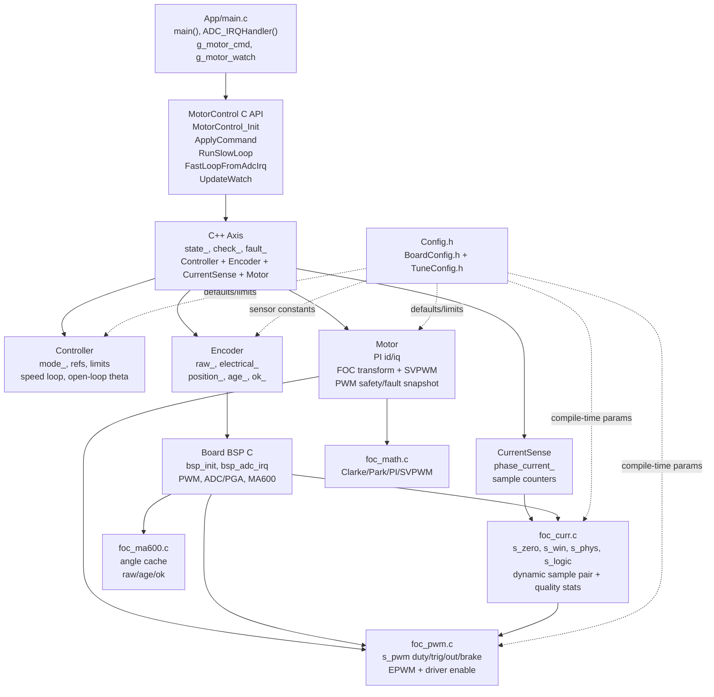
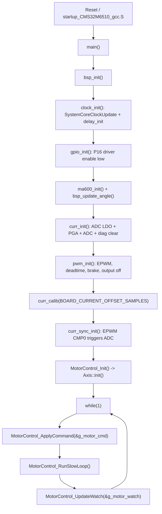
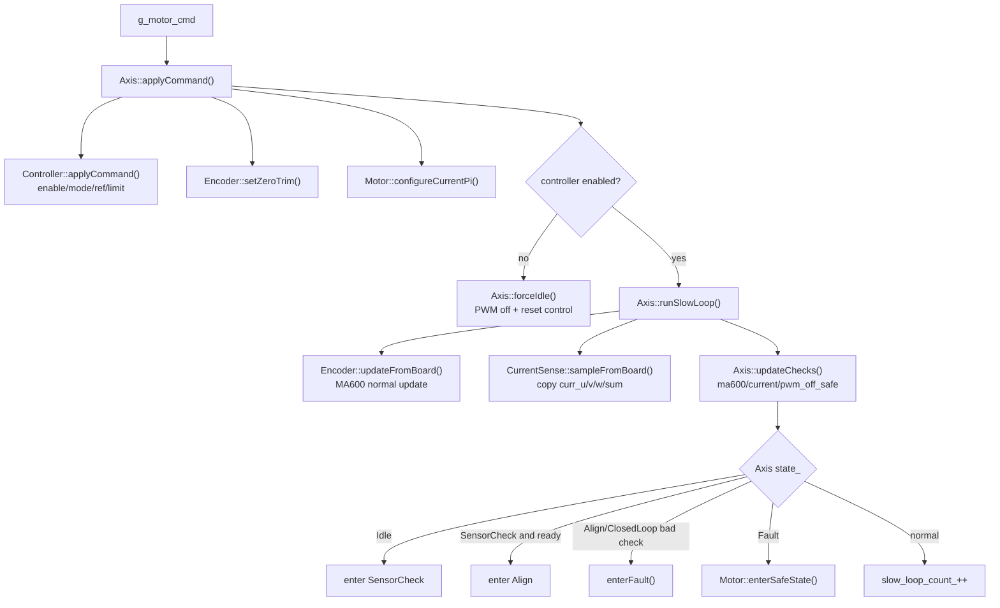
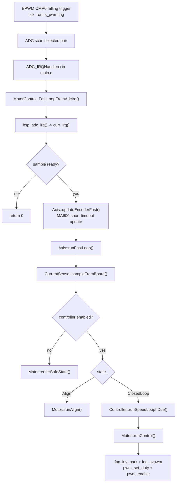
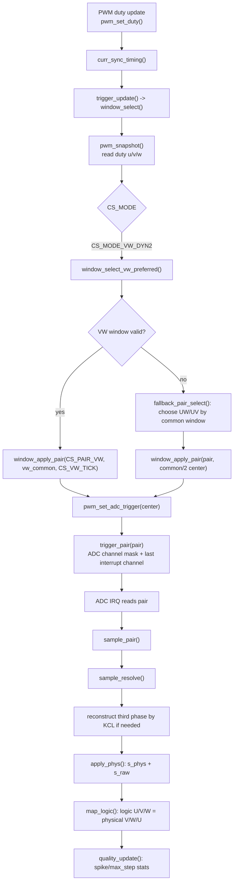
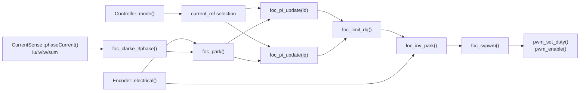

# Runtime Control Flow

> Historical note: this document describes the earlier C++ Axis runtime flow. The current `cms32foc` firmware is pure C bring-up, and all C++ targets are frozen by default. Use `Docs/Architecture/ActiveControlChain.md` as the source of truth for the active runtime flow.

本文记录早期 CMS32FOC_GCC 的 C/C++ 混合结构：C 负责启动、BSP、PWM/ADC/MA600 和 FOC 数学函数；C++ 负责 Axis/Controller/Motor/Encoder/CurrentSense 这些控制对象。当前该 C++ 控制层不参与默认编译。

## Current Status

- 主入口是 `Firmware/App/main.c`，全局调试入口是 `g_motor_cmd` 和 `g_motor_watch`。
- 当前 `cms32foc` 默认链接 `cms32_motor_control_c`，不创建也不编译 `cms32_motor_control`。
- 配置入口是 `Firmware/Board/Config/Config.h`，它只包含两个实际配置文件：
  - `BoardConfig.h`：不常改的板级和电机硬件基线，例如 `PWM_PERIOD`、`PWM_DEADTIME_TICKS`、`MOT_ELEC_ZERO`。
  - `TuneConfig.h`：当前电流采样和控制调试参数，例如 `CS_MODE`、`CS_VW_TICK`、`CTRL_CUR_KP`、`OL_VF_VOLTAGE`。
- 当前电流采样策略是 `CS_MODE_VW_DYN2`：优先固定 `VW @ CS_VW_TICK=650`，窗口不足时 fallback 到 `UW/UV`。
- `Config.hpp` 已删除，C++ 控制层直接 include `Config.h` 并使用短宏，减少双份配置维护。

## Architecture Diagram



## Boot And Main Loop



`main()` 本身不做控制计算，只做调度。调参时通过 Ozone 改 `g_motor_cmd`，观察 `g_motor_watch`。

## Slow Loop Flow

慢环由 `main()` 中的 while 循环调用，不依赖 ADC 中断。它负责命令接收、状态机推进、慢速安全检查和 watch 更新。



### Axis State Meaning

| State | Value | Meaning |
| --- | ---: | --- |
| `Idle` | 0 | 控制未启动或刚复位，PWM 保持安全关断。 |
| `SensorCheck` | 1 | 等待 MA600、电流检查、PWM 关断安全检查通过。 |
| `Align` | 2 | 输出固定 d 轴对齐电压，持续 `MOT_ALIGN_TICKS`。 |
| `ClosedLoop` | 3 | 根据 `ControlMode` 运行 VF/IF/电流/速度控制。 |
| `Fault` | 4 | 故障态，强制 `Motor::enterSafeState()`。 |

## ADC Fast Loop Flow

快环由 EPWM CMP0 触发 ADC，ADC 完成后进入 `ADC_IRQHandler()`。只有 `curr_irq()` 返回有效样本时，才运行 C++ 快环。



## Current Sampling Flow

当前采样策略由 `TuneConfig.h` 控制：

```c
#define CS_MODE CS_MODE_VW_DYN2
#define CS_PAIR CS_PAIR_VW
#define CS_MULTI_EN 0U
#define CS_DYN_EN 1U
#define CS_VW_TICK 650U
```



### Current Sampling Variables

| Variable | Owner | Meaning |
| --- | --- | --- |
| `s_zero.u/v/w` | `foc_curr.c` | 静态零漂 ADC offset。 |
| `s_win.pair` | `foc_curr.c` | 当前采样 pair，`2` 表示 VW。 |
| `s_win.center` | `foc_curr.c` | 当前 ADC 触发中心 tick；VW 优先模式下正常为 `650`。 |
| `s_win.common` | `foc_curr.c` | 当前 pair 的共同可采窗口宽度。 |
| `s_win.hold` | `foc_curr.c` | 当前是否保持旧样本，不更新电流。 |
| `s_win.switch_count` | `foc_curr.c` | pair 切换计数。 |
| `s_win.fallback_count` | `foc_curr.c` | 从 VW 退到 UW/UV 的计数。 |
| `s_quality.iv/iw_spike_count` | `foc_curr.c` | V/W 真实采样相跳变超过 `CS_SPIKE_LIMIT_CNT` 的次数。 |
| `s_quality.iv/iw_max_step` | `foc_curr.c` | V/W 相邻有效样本最大跳变。 |
| `s_phys.u/v/w` | `foc_curr.c` | 物理 U/V/W 电流 count。 |
| `s_logic.u/v/w` | `foc_curr.c` | FOC 使用的逻辑 U/V/W，当前映射为 physical V/W/U。 |

## Motor Control Data Flow



### Control Modes

| Mode | Value | Fast-loop behavior |
| --- | ---: | --- |
| `Off` | 0 | PWM 安全关断。 |
| `Current` | 1 | 使用 `g_motor_cmd.id_ref/iq_ref` 作为电流环给定。 |
| `Speed` | 2 | 速度环输出 `speed_iq_ref_`，再进入 q 轴电流环。 |
| `VfOpenLoop` | 3 | `Controller::updateOpenLoopTheta()` 生成角度，输出 `vf_voltage`。 |
| `IfOpenLoop` | 4 | 开环角度 + `if_id_ref/if_iq_ref` 进入电流环。 |

## Command And Watch Variables

### `g_motor_cmd`

`g_motor_cmd` 是外部调试输入，Ozone 可以实时修改。

| Field | Used by | Meaning |
| --- | --- | --- |
| `enable` | `Controller::applyCommand()` | 0 关断，非 0 允许状态机运行。 |
| `control_mode` | `Controller::applyCommand()` | 对应 `ControlMode`。 |
| `id_ref`, `iq_ref` | `Motor::runControl()` | 电流模式给定。 |
| `speed_ref`, `iq_limit` | `Controller::runSpeedLoopIfDue()` | 速度模式给定和 iq 限幅。 |
| `current_kp`, `current_ki`, `current_v_limit` | `Motor::configureCurrentPi()` | 电流环 PI 和输出限幅。 |
| `open_loop_speed_ref` | `Controller::updateOpenLoopTheta()` | VF/IF 开环角度步进速度。 |
| `vf_voltage` | `Motor::runControl()` | VF 模式 d 轴电压幅值。 |
| `if_id_ref`, `if_iq_ref` | `Motor::runControl()` | IF 模式电流给定。 |
| `open_loop_timeout_ms` | `Motor::runControl()` | VF/IF 超时保护。 |
| `elec_zero_trim` | `Encoder::electricalFromRaw()` | 电角度零点临时修正。 |

### `g_motor_watch`

`g_motor_watch` 是主要观察出口，由 `Axis::fillWatch()` 汇总。

| Group | Fields | Source |
| --- | --- | --- |
| State | `state`, `control_mode`, `fault_reason`, `enable` | `Axis` + `Controller` |
| Counters | `slow_loop_count`, `fast_loop_count`, `adc_sample_count` | `Axis` + `CurrentSense` |
| Encoder | `encoder_raw`, `encoder_elec`, `encoder_delta`, `encoder_pos`, `encoder_age`, `encoder_ok` | `Encoder` |
| Current | `iu_cnt`, `iv_cnt`, `iw_cnt`, `i_sum`, `id`, `iq` | `CurrentSense` + `MotorSnapshot` |
| References | `id_ref`, `iq_ref`, `speed_ref`, `speed_fb` | `MotorSnapshot` + `Controller` |
| Voltage/PWM | `vd`, `vq`, `v_limited`, `duty_u/v/w`, `pwm_safe`, `pwm_running` | `Motor` + `PWM` |
| Sampling | `sample_pair`, `sample_hold`, `sample_common_window` | `foc_curr.c` through `CurrentSense` |
| Sampling quality | `sample_switch_count`, `sample_fallback_count`, `iv_spike_count`, `iw_spike_count`, `iv_max_step`, `iw_max_step` | `foc_curr.c` |
| Checks | `check.ma600_ok`, `check.current_ok`, `check.pwm_off_safe`, `check.ready_closed_loop` | `Axis::updateChecks()` |

## Practical Debug Path

1. 修改 `TuneConfig.h` 中的采样参数，例如 `CS_VW_TICK`、`CS_HYST_TICK`、`CS_MIN_HOLD_PWM`。
2. 烧录后先让 `g_motor_cmd.control_mode = 3`，使用 VF 强拖观察电流采样。
3. 重点看：
   - `g_motor_watch.sample_pair`
   - `g_motor_watch.sample_common_window`
   - `g_motor_watch.sample_switch_count`
   - `g_motor_watch.sample_fallback_count`
   - `g_motor_watch.iv_spike_count`
   - `g_motor_watch.iw_spike_count`
   - `g_motor_watch.iv_max_step`
   - `g_motor_watch.iw_max_step`
4. 如果 `sample_switch_count` 快速增长，说明动态 pair 抖动，需要增大 `CS_HYST_TICK` 或 `CS_MIN_HOLD_PWM`。
5. 如果 `iv/iw_spike_count` 增长明显，优先检查采样 tick、PWM duty 区域和是否需要更强的坏样本门控。
