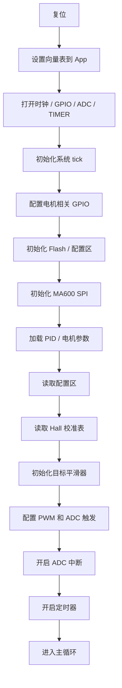
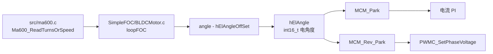

# 16 ACC参考工程指南

本文记录参考工程 `D:\wjw\MotorRec\01_ELA_ACC` 的结构、启动流程、实时控制链路和可复用经验。后续编写 `CMS32FOCAC6` 时，如用户说“按 acc 处理”，默认按本文理解。

## 1. 工程定位

`acc` 是一个成熟的 ELA 电机控制项目，目标芯片是 `GD32F303CC`。它不是 CMS32 的直接移植对象，但它已经把完整的电机控制路径跑通了，所以适合作为：

- FOC 架构参考
- MA600 SPI 读角度参考
- 启动流程参考
- 快慢环分层参考
- 上位机调试与参数保存参考

## 2. 主要目录职责

| 目录 | 作用 |
|---|---|
| `main.c` | 系统入口、初始化、主循环、中断入口 |
| `SimpleFOC/` | 电机对象、FOC 主逻辑、PID、SVPWM、控制框架 |
| `stfoc/` | 数学运算、控制器、PWM 电流反馈相关组件 |
| `src/` | MA600、线性 Hall、位置预测、角度对齐、ADC 轮询 |
| `bsp/` | 串口协议、Flash、滤波器、温度、引脚映射、调试输出 |
| `config/` | 硬件版本、默认参数、配置区读写 |
| `linear_pos/` | 线性 Hall 训练/校准参数 |

## 3. 启动流程



## 4. 实时控制链路


特点是：

- 高速控制在中断里跑
- MA600 角度也在快环里读取
- PWM 更新和采样节拍紧耦合

## 5. 慢速任务链路

主循环主要处理低速任务：

- 目标位置平滑
- 位置环
- 线性 Hall 预测与滤波
- MA600 与 Hall 融合
- 电角度对齐
- 状态机
- 温度保护
- 上位机通信

这类任务不应该放进 ADC 中断里。

## 6. MA600 参考价值

`acc` 的 MA600 代码告诉我们几件事：

1. 读角度不是唯一功能，还包括读寄存器、写寄存器、清错误、NVM 存储。
2. 写寄存器后最好做回读校验。
3. SPI 事务之间需要合适的空闲间隔。
4. `CS` 低有效，读写前先拉低，结束后拉高。
5. 初始化应当带超时，不要无限卡死。

## 7. MA600 到电角度的架构

`acc` 里真正参与 FOC 的 MA600 链路不是 `SimpleFOC/Sensor.c` 那套浮点 `getAngle()`，而是下面这条定点链路：



关键代码位置：

| 文件 | 作用 |
|---|---|
| `src/ma600.c` | 初始化 MA600 SPI，读 16 位角度，配置 `0x1C` 让第二个 16 位返回速度 |
| `SimpleFOC/BLDCMotor.c` | 在 `loopFOC()` 中读取 MA600，把角度减零点偏移后作为 FOC 电角度 |
| `src/angle_aline.c` | 开环拖动电机，比较开环角和 MA600 角，求 `hElAngleOffSet` 并保存 |
| `stfoc/mc_math.c` | `MCM_Park()` / `MCM_Rev_Park()` 使用 `int16_t` Q1.15 电角度查表计算 sin/cos |

`acc` 的核心处理可以概括为：

```c
Ma600_ReadTurnsOrSpeed(&angle, &value);
motor.hElAngle = angle - motor.hElAngleOffSet;
motor.Iqd = MCM_Park(motor.Ialphabeta, motor.hElAngle);
motor.Valphabeta = MCM_Rev_Park(motor.Vqd, motor.hElAngle);
```

这里没有再执行 `电角度 = 机械角 * 极对数`。它默认 MA600 读出来的 `angle` 已经是控制要用的周期角，只需要减去电角度零点偏移。

这一点非常适合当前 CMS32FOCAC6 板子参考，因为当前硬件已经实测：

- 电机转子是 4 对极。
- 空心磁环也测得 4 对极。
- MA600 读数在机械一圈内变化 4 次。

因此当前项目的 MA600 raw 更接近“电角度传感器”，而不是“机械角传感器”。后续不要照搬 `ThetaE = ThetaM * pole_pairs`，否则会把电角度再乘 4 倍。

## 8. ACC 的角度校准方式

`acc` 用 `MotorAngleAline()` 自动求电角度偏移，思路是：

1. 临时把 `hElAngleOffSet` 清零。
2. 用开环 `d` 轴电压拖动电机正反转。
3. 记录开环角 `motor.openloop.angle` 与实际 MA600 电角 `motor.hElAngle` 的差。
4. 对跨越 `65536` 的差值做解缠。
5. 求平均后得到 `hElAngleOffSet`。
6. 保存到 Flash，下次启动时从配置区加载。

可以学它的思路，但当前带丝杠电机不能长时间单向转，所以 CMS32FOCAC6 后续要改成“有限角度摆动式校准”：

- 小电流、小角度来回拉动。
- 每一步都检查限位、过流和位置变化。
- 只在安全行程内采样偏移。
- 校准结果先放 RAM 观察，确认可靠后再考虑保存。

## 9. 对当前项目的落地建议

建议当前 CMS32FOCAC6 采用下面的角度对象，而不是把角度散在多个局部变量里：

| 字段 | 含义 |
|---|---|
| `raw` | MA600 原始 16 位角度 |
| `elec` | 减零点、方向修正后的电角度，给 Park/反 Park 用 |
| `prev_raw` | 上一次 raw，用于 delta 解缠 |
| `pos` | 累加位置。注意它是“磁环周期累计”，不是直接的机械圈数 |
| `speed` | MA600 第二个 16 位速度，或由 delta 估算 |
| `age` | 角度缓存已经过了几个快环周期，用于判断角度是否过旧 |
| `ok` | SPI 读数是否可信 |

调度上建议和 `acc` 做一个温和的取舍：

| 阶段 | MA600 读取 | 电流环 | 原因 |
|---|---:|---:|---|
| 初期闭环验证 | 主循环或快环分频 1 kHz ~ 5 kHz | 1 kHz ~ 5 kHz | 先保证主循环不被饿死 |
| 稳定后 | 快环分频 5 kHz ~ 10 kHz | 10 kHz | 测 SPI 耗时后再提升 |
| 最终目标 | 根据实测决定是否每拍读 | 20 kHz 以上 | 只有快环耗时足够短才允许 |

快环里应优先读取缓存电角度：

```text
ADC/PWM 同步中断
  -> 读取电流
  -> 读取已缓存 elec angle
  -> Clarke / Park
  -> Id/Iq PI
  -> 反 Park / SVPWM
  -> 更新 PWM
```

MA600 SPI 读角可以先独立出来：

```text
Motor_TASK 或分频快环
  -> Board_MA600_Update()
  -> raw 有效性检查
  -> raw - offset
  -> 方向修正
  -> 更新 elec / pos / speed / age
```

等确认 SPI 耗时、主循环占用和中断占用后，再决定是否把 MA600 更新频率提高。

## 10. 迁移时容易犯错的点

- `acc` 在 MA600 初始化里写 `0x1C = 0x80`，表示第二个 16 位读 speed；当前项目如果没有写这个寄存器，就不要把第二个 16 位当速度。
- `hElAngle` 是 `int16_t` 电角度，`-32768 ~ 32767` 表示一圈电角度，不是角度制的 `0 ~ 360`。
- `uint16_t angle - int16_t offset` 再赋给 `int16_t`，本质是利用 16 位环绕。以后自己写时要明确这是“周期角”，不要用普通 `int32_t` 差值后忘记取模。
- `pos_raw += (int16_t)(angle - prev_angle)` 只在相邻两次采样的角度变化小于半圈时可靠；采样太慢或转速太高会丢圈。
- 当前磁环是 4 对极，`pos_raw` 每机械一圈会累计约 `4 * 65536`。这个比例只表示 MA600/磁环位置累计关系，不再用于旧的丝杠 `0.02 mm/rev` 换算。
- ACC 在 ADC 中断里直接读 4 字节 SPI，这对 GD32F303 参考价值较高，但 CMS32M6513 的 64 MHz M0+ 不应盲目照搬。之前已经验证过，快环太重会让主循环进不去。

## 11. 对 CMS32FOCAC6 的可借鉴点

- 把 `Board`、`Motor`、`App` 分层做清楚
- 快环和慢环分开
- MA600 作为板载外设，不直接暴露给 `Motor`
- 所有 SPI 细节收口到 `Board_MA600.c`
- 用状态机管理启动、校准、运行、故障
- 用文档固化参数和节拍，不靠记忆
- 综合后的 CMS32 落地方案见 [[19 FOC早期综合方案]]。

## 12. 风险提示

`acc` 里有一些值得借鉴但也要小心的地方：

- MA600 初始化如果没有超时，故障时会卡死
- 串口命令路径里可能包含 Flash 擦写
- 实时中断里做太多事情会影响控制周期
- 位置融合里有不少硬编码参数，迁移时不能直接照搬

## 13. 使用约定

以后在本项目里：

- 用户说 `acc`，默认指 `D:\wjw\MotorRec\01_ELA_ACC`
- 用户说“按 acc 改”，默认优先参考本文的启动流程和控制链路
- 用户说“acc 的 MA600”，默认参考 `src/ma600.c`
- 用户说“acc 的启动流程”，默认参考本文第 3 节
