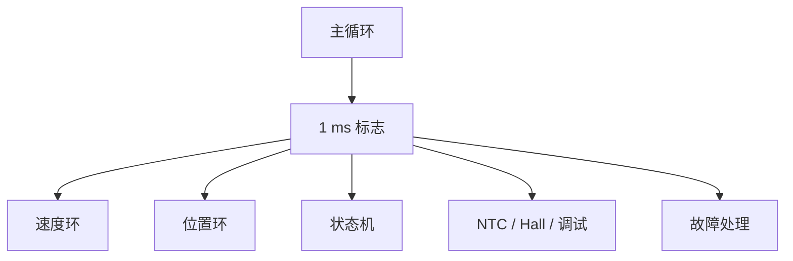

# 19 FOC早期综合方案

> 2026-05-28 说明：本文是早期综合方案，里面关于 `16 MHz`、`8 kHz PWM`、`4 kHz 电流环` 的内容已经不是当前最新状态。当前工程已在 ARMCC5 下确认 `64 MHz`，PWM 已按 `20 kHz` 运行，EPWM CMP0 触发 ADC 已验证。最新执行路线请优先看 [[00 文档入口]] 和 [[08 控制框架路线图]]。

本文把三件事合在一起：

1. 你当前 `CMS32M6513AGE40NB` 板子的真实硬件约束。
2. `acc` 参考工程已经跑通的 FOC 组织方式。
3. 当前 `CMS32FOCAC6` 工程的分层和外设规划。

目标不是“写得最满”，而是先做出一套能安全上板、能逐步验证、能继续扩展的方案。

## 1. 结论先说

推荐方案如下：

- `Board` 负责硬件适配和安全状态。
- `Motor` 负责状态机、FOC、电流环、速度环、位置环。
- `App` 只做启动和任务调度。
- MA600 放在 `Board_MA600.c`，不单独起 `Encoder` 层。
- 电流采样链路先做通，再做闭环。
- PWM 默认关闭输出，直到采样、方向、零点、死区、保护都确认。
- 当前先按 `16 MHz` 起步，先做 `8 kHz` PWM / `4 kHz` 电流环的保守版本。
- `acc` 的快慢环分离方式可以直接借鉴，但外设接口必须换成 CMS32M65xx 的。

## 2. 当前硬件要点

你这块板最重要的约束是：

- MA600 在 `P02/P03/P04/P05`
- `P06/P07` 先保留 SWD
- 三相低边电流采样在 `P00/P01`、`P24/P25`、`P26/P27`
- NTC 在 `P20/AN4`
- Hall 在 `P21/P22/P23`
- PWM 和刹车是安全敏感路径

这意味着：

- 不能先把 `P03/P04/P05` 改成串口
- 不能一上电就打开功率输出
- 不能把 MA600 放到 `Motor` 里直接裸读寄存器
- 不能在快环里做大段打印或复杂阻塞

## 3. 从 acc 借来的结构

`acc` 已经验证了这条路是可行的：

```text
PWM 触发 ADC -> 中断里跑快环 -> 主循环跑慢环 -> MA600 提供角度 -> 位置/速度/电流分层
```

它对我们最有价值的点是：

- FOC 不要和初始化混在一起
- 编码器不只是“读一下角度”，而是一个完整事务
- 主循环和中断各做各的事
- 位置/速度/电流三个环不要互相乱插

## 4. 推荐控制链路


慢任务走主循环：



## 5. 推荐初始化顺序

```text
1. SystemCoreClockUpdate
2. Board_InitClock
3. Board_InitGPIO
4. Board_InitDebugPort
5. Board_InitMA600Spi
6. Board_InitAdcCur
7. Board_InitPwm
8. Motor_Init
9. 进入主循环
```

其中：

- `Board_InitPwm` 只配安全态，不开输出
- `Board_InitMA600Spi` 先加超时，后加真实读写
- `Board_InitAdcCur` 先做零漂，再做闭环

## 6. 调试阶段建议

### 阶段 1

只做：

- 时钟
- GPIO
- SWD 保留
- MA600 SPI 基础收发
- 电流采样通道确认

不要急着开 PWM。

### 阶段 2

做：

- ADCLDO
- PGA
- ADC
- 零电流 offset
- 示波器看采样点

### 阶段 3

做：

- 开环低占空比
- 确认方向
- 确认 MA600 零点
- 确认 Hall 顺序

### 阶段 4

做：

- 电流环
- 速度环
- 位置环
- 故障保护

## 7. 这套方案里最容易漏掉的点

1. **MA600 事务完整性**
   - 不是只拉低 CS 就够了
   - 需要写、读、等、验、超时

2. **电流采样极性**
   - offset 不只是“采个中值”
   - 采样极性和放大倍数都要实测

3. **PWM 安全态**
   - 死区、极性、inactive 电平、刹车链路要先确认
   - 不确认就不要真正驱动电机

4. **时钟和性能**
   - 当前先按 16 MHz 起步，不要假设 64 MHz 已经可用
   - `M0+` 没 FPU，后面高频闭环可能要局部定点

5. **调试口**
   - `P06/P07` 开发阶段不要占用

6. **中断里别干慢活**
   - 不要打印
   - 不要 Flash 擦写
   - 不要做长时间 SPI 等待

7. **MA600 磁环安装**
   - 侧边安装时读到的是磁场角
   - 要做方向、零点和非线性校准

## 8. 适合现在就写的代码

优先写这些：

- `Board_Init`
- `Board_InitMA600Spi`
- `Board_InitAdcCur`
- `Board_InitPwm`
- `Motor` 状态机
- `Motor_TASK1ms`
- `Motor_FastLoop`

暂时不要急着写：

- Bootloader
- Flash 在线写入
- 大量串口命令
- 复杂 UI

## 9. 结论

综合硬件、`acc`、现有工程结构后，最稳的路线是：

**先把硬件链路安全地搭起来，再把 `acc` 的快慢环节拍搬过来，最后才逐步收紧到闭环。**

这条路线对你现在这个板子是合适的。
