# 21 SVPWM互补PWM与ADC采样点教学

本文把当前 `CMS32FOCAC6` 工程里的 SVPWM、互补 PWM、低边三电阻采样和 ADC 触发点串成一条学习线。

先记住一句总纲：

```text
FOC 算法给出目标电压矢量
  -> SVPWM 把电压矢量变成三相 duty
  -> EPWM 用三相 duty 产生互补方波
  -> 方波经过电机电感后形成连续电流
  -> ADC 只应该在低边电流路径稳定时采样
  -> 两相电流进入 FOC，第三相由三相和重构
```

本文所有波形都是教学概念图。真实高低电平极性、死区后的实际波形、续流路径、ADC 点是否真正干净，必须以示波器和实测电流波形确认。

## 1. 当前工程先对上号

当前板子是三相低边采样。每一相低边源极经过 `80 mOhm` 电阻到地，采样节点进 PGA，再进 ADC。

| 相 | 功率网络 | 采样脚 | PGA | ADC | PWM 主通道 | PWM 互补通道 |
| --- | --- | --- | --- | --- | --- | --- |
| U | `NU` | `P00/P01` | `PGA0` | `ADC_CH_0` | `EPWM0` | `EPWM1` |
| V | `NV` | `P24/P25` | `PGA1` | `ADC_CH_2` | `EPWM2` | `EPWM3` |
| W | `NW` | `P26/P27` | `PGA2` | `ADC_CH_3` | `EPWM4` | `EPWM5` |

当前关键参数在 `User/Config/Config.h`：

```c
#define PWM_FREQ_HZ 20000U
#define PWM_PERIOD 1600U
#define PWM_DUTY_50 800U
#define PWM_DUTY_MIN 300U
#define PWM_DUTY_MAX 1300U
#define PWM_DEADTIME_TICKS 64U
#define PWM_ADC_TRIGGER_TICK_DEFAULT 650
#define CURRENT_SAMPLE_PAIR CURRENT_SAMPLE_VW
```

当前 PWM/ADC 链路：

```text
EPWM_COUNT_UP_DOWN          中心对齐计数
EPWM_OCU_SYMMETRIC          对称 PWM
EPWM_WFG_COMPLEMENTARYK     互补输出
EPWM0/2/4                   U/V/W 主通道
EPWM1/3/5                   U/V/W 互补通道
EPWM0 CMP0 falling          下降计数到 CMP0 时触发 ADC
```

当前电流采样链路：

```text
EPWM0 CMP0 falling, tick = 650
  -> ADC 硬件触发
  -> 当前采 ADC_CH_2 / ADC_CH_3
  -> Board_AdcIrqHandler()
  -> Board_UpdateCurrent()
  -> Motor_FastLoop()
```

当前 `CURRENT_SAMPLE_PAIR = CURRENT_SAMPLE_VW` 时，`Board_Analog.c` 的实际逻辑映射是：

```text
physical raw V = ADC_CH_2 - V offset
physical raw W = ADC_CH_3 - W offset
physical raw U = 运行时没有触发采样，被软件压回 offset 附近

logic Iu = raw V
logic Iv = raw W
logic Iw = -logic Iu - logic Iv
```

这句话很重要：本文说“当前工程采 V/W”，指的是物理 ADC 通道采 `ADC_CH_2/3`；而送进 FOC 的 `logic Iu/Iv/Iw` 已经经过当前代码映射。后续如果确认相序和命名需要修正，代码和文档要一起改。

## 2. PWM 是方波，SVPWM 马鞍波是什么

MOS 管最终看到的是方波，不是正弦波，也不是马鞍波。

单个 PWM 周期内，某一相大概像这样：

```text
U PWM:  ____------------____
V PWM:  ______------________
W PWM:  __--------------____
```

这些方波每个周期的宽度不同。把很多个 PWM 周期的 `duty_u/duty_v/duty_w` 连起来看，才会看到类似正弦或马鞍波的包络。

```text
单个 PWM 周期：看到方波

周期1:  U ____------____
周期2:  U ___--------___
周期3:  U __----------__
周期4:  U ___--------___
周期5:  U ____------____

很多个周期的 duty 连起来：看到包络

duty
 ^
 |        __----__
 |    ___/        \___
 |___/                \___
 +--------------------------> 电角度/时间
```

所以“SVPWM 合成马鞍波”的准确理解是：

```text
SVPWM 每个 PWM 周期算出一组三相 duty。
MOS 仍然输出方波。
电机绕组电感把高速方波平均成连续电流。
把 duty 随电角度的变化画出来，才看到马鞍形包络。
```

ADC 采样点不是从马鞍波上随便挑，而是在某个 PWM 方波周期内，找低边电流路径稳定的位置。

## 3. PWM 周期、电角周期、60 度扇区

这里最容易混的是三个周期。

```text
PWM 周期：
  开关频率周期。当前是 20 kHz，一个周期约 50 us。

电角周期：
  FOC 电角度从 0 到 360 度的一圈。

SVPWM 扇区：
  一个电角周期分 6 个扇区，每个扇区 60 度。
```

一个电角周期会经过 6 个扇区：

```text
电角度: 0        60       120      180      240      300      360
        |--------|--------|--------|--------|--------|--------|
          扇区1    扇区2    扇区3    扇区4    扇区5    扇区6
```

一个 PWM 周期通常只处在当前电角度所在的一个扇区内。不是一个 PWM 周期走完 6 个扇区。

例如：

```text
PWM 频率 = 20 kHz
电角频率 = 200 Hz

一个电角周期 = 1 / 200 = 5 ms
一个 PWM 周期 = 1 / 20000 = 50 us
一个电角周期内约有 100 个 PWM 周期
每个 60 度扇区约有 100 / 6 = 16.7 个 PWM 周期
```

所以 60 度扇区内不是 duty 不变，而是：

```text
扇区编号：一段时间内不变
矢量组合方式：一段时间内基本同一套
T1/T2/T0：每个 PWM 周期都在变
duty_u/v/w：每个 PWM 周期都在变
```

图形上：

```text
电角度:       0 度                         60 度
              |----------------------------|
扇区:                  Sector 1

PWM 周期:     | | | | | | | | | | | | | | |
              1 2 3 4 5 6 7 8 9 ...

duty_u/v/w:   每个 PWM 周期更新一次，慢慢形成包络
```

如果一个 60 度扇区内 duty 完全不变，输出电压矢量就固定住了，电机不会得到平滑旋转磁场。

## 4. 当前中心对齐 PWM 时间轴

当前 `PWM_PERIOD = 1600`，中心对齐计数是：

```text
0 -> 1600 -> 0
```

完整 PWM 周期是上数加下数：

```text
完整 PWM 周期 = 3200 tick
64 MHz / 3200 = 20 kHz
```

图形：

```text
tick:      0        650      800          1600       800      650        0
counter:  |---------|--------|-------------|----------|--------|---------|
dir:      up        up       up            top        down     down      zero
                         50% duty                    ADC
                                                     CMP0=650
```

`CMP0=650 falling` 的意思不是“贴着 PWM 方波下降边沿采样”，而是：

```text
中心对齐计数器从 1600 往 0 数；
数到 650 时，由 EPWM0 CMP0 触发 ADC。
```

所以“下降沿采样”更准确应该叫：

```text
下降计数段同步采样
```

它不是这个：

```text
PWM 方波:  ____|--------|____
                ^
                贴边沿采，错误理解
```

而是这个：

```text
计数器: 0 ---------------- 1600 ---------------- 0
              上升计数                下降计数
                                      ^
                                      某个稳定窗口里的 ADC 点
```

工程上喜欢把采样点放在下降计数段，主要是因为节拍清楚：

```text
本 PWM 周期已经输出一部分
  -> 在后半段找稳定低边窗口采样
  -> ADC 转换完成
  -> 快环计算
  -> 结果更新到下一 PWM 周期
```

但真正决定采样准不准的不是“下降计数段”这四个字，而是采样点是否落在低边导通稳定窗口中间。

## 5. SVPWM 从 v_alpha/v_beta 到 duty

当前 `Foc_Svpwm()` 的输入是：

```text
v_alpha / v_beta：定子 alpha-beta 坐标下的目标电压矢量
vdc：当前代码里传入 PWM_PERIOD，可理解成 PWM 标尺
```

函数先把 alpha-beta 投影到三相：

```text
vu = v_alpha
vv = -v_alpha / 2 + v_beta * 0.866
vw = -v_alpha / 2 - v_beta * 0.866
```

再找最大、最小，加入零序偏置：

```text
vzero = -((vmax + vmin) / 2)
```

最后得到三相 duty：

```text
duty_u = center + vu + vzero
duty_v = center + vv + vzero
duty_w = center + vw + vzero
```

这就是 SVPWM 的直觉：三相不是各自孤立输出正弦，而是一起加一个零序分量，让母线利用率更高。


## 6. 三相桥臂和互补 PWM

一相半桥可以简化成：

```text
        VM
         |
      上桥臂
         |
相输出 -----> 电机绕组
         |
      下桥臂
         |
     采样电阻
         |
        GND
```

互补 PWM 的意思是：同一相的上桥臂和下桥臂大体反相，中间插入死区，避免上下管直通。

```text
U 上管概念:  ____--------________--------____
U 下管概念:  ----________--------________----
                     ^死区        ^死区
```

当前工程对应关系：

```text
EPWM0 -> U 主通道
EPWM1 -> U 互补通道
EPWM2 -> V 主通道
EPWM3 -> V 互补通道
EPWM4 -> W 主通道
EPWM5 -> W 互补通道
```

实际主通道高电平是否等于上管导通，要结合芯片驱动极性和示波器确认。本文后面用 `1/0` 只是为了讲开关状态，不等于最终示波器电平。

## 7. 低边采样为什么不能任意时刻采

低边电阻在下管下面。只有某相下管稳定承载该相电流时，该相低边电阻电压才适合代表相电流。

```text
低边有效采样路径：

电机绕组电流
  -> 相输出节点
  -> 下桥臂
  -> 低边采样电阻
  -> GND
```

下面这些时刻不适合直接采：

```text
MOS 刚开通
MOS 刚关断
死区期间
体二极管续流切换
开关节点振铃
PGA/ADC 输入还没稳定
```

采样点应该放在稳定窗口中间：

```text
某个可采样窗口：

边沿/死区      稳定低边导通区            边沿/死区
|----x----|========================|----x----|
                 ^        ^        ^
                可采     最佳      可采
```

这就是为什么三电阻硬件不等于任意时刻都能采三相。硬件有 U/V/W 三个电阻，只代表“有采样能力”；能不能采到可信电流，还要看当前开关状态。

低边采样路径图：

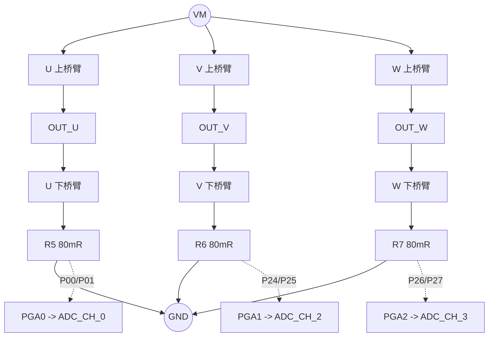

## 8. 用上管状态看哪些相能采

下面约定：

```text
上管状态 UVW
1 = 该相上管导通、下管关断
0 = 该相上管关断、下管导通
```

忽略死区后，稳定状态可以这样判断：

| 上管状态 | 稳定导通的下管 | 适合直接采样 |
| --- | --- | --- |
| `100` | V、W 下管 | 采 V/W，U 重构 |
| `010` | U、W 下管 | 采 U/W，V 重构 |
| `001` | U、V 下管 | 采 U/V，W 重构 |
| `110` | W 下管 | 只能直接采 W，不够两相 |
| `101` | V 下管 | 只能直接采 V，不够两相 |
| `011` | U 下管 | 只能直接采 U，不够两相 |
| `000` | U、V、W 下管 | 理论可采三相，但属于零矢量区 |
| `111` | 无下管 | 低边采样无效 |

所以最常用的两相有效窗口是：

```text
100 -> 采 V/W
010 -> 采 U/W
001 -> 采 U/V
```

这也回答了“U 要在哪里采”：

```text
U 下管稳定导通时才能直接采 U。
更推荐在 010 或 001 这种两相下管稳定导通的有效矢量中采 U。
如果当前半周期只有到 000 才出现 U 下管，U 在该半周期就只能在零矢量区直接采，或者由 V/W 重构。
```

## 9. 一个 PWM 周期里的状态窗口

以某个扇区的下降计数段为例，可能出现：

```text
下降计数: 1600 -------------------------------------- 0

状态:       111        110        100        000
            |----------|----------|==========|------|
下管:       无         W          V W        U V W
可采:       不采       只 W       采 V/W     可采 U/V/W 但属零矢量
                                     ^
                                     主采样点放这里
```

这里 `100` 是最适合采 V/W 的稳定窗口。U 没有直接采，而是：

```text
U = -V - W
```

换一个扇区，U 可能在有效矢量里很好采：

```text
下降计数: 1600 -------------------------------------- 0

状态:       111        011        001        000
            |----------|----------|==========|------|
下管:       无         U          U V        U V W
可采:       不采       只 U       采 U/V     可采 U/V/W
                                     ^
                                     U/V 主采样点
```

再换一个：

```text
下降计数: 1600 -------------------------------------- 0

状态:       111        110        010        000
            |----------|----------|==========|------|
下管:       无         W          U W        U V W
可采:       不采       只 W       采 U/W     可采 U/V/W
                                     ^
                                     U/W 主采样点
```

因此，同一个扇区算法里会有比较明确的“最好采的两相窗口”。不是所有相在所有时刻都同样好采。

## 10. 当前固定 VW 采样怎么理解

当前工程不是按扇区动态切换 `UV/UW/VW`，而是固定：

```text
CURRENT_SAMPLE_PAIR = CURRENT_SAMPLE_VW
ADC_CH_2 = physical V
ADC_CH_3 = physical W
```

也就是：

```text
采 V/W
U 由 -V-W 重构
```

但当前代码送进 FOC 的 logic 命名又做了一层映射：

```text
logic Iu = raw V
logic Iv = raw W
logic Iw = -raw V - raw W
```

所以观察 JScope 时要分清三类电流：

| 名称 | 含义 | 用途 |
| --- | --- | --- |
| raw current | 物理 ADC/PGA 通道扣零漂后的值 | 判断硬件采样、噪声、窗口 |
| logic current | 映射后送进 FOC 的三相电流 | 判断 Clarke/Park 和闭环响应 |
| reconstructed current | 没直接采样、由三相和算出的相 | 判断两相采样是否自洽 |

当前 `VW` 采样下，未被运行时触发的 raw U 会被软件压回 offset，`raw U cnt` 接近 0 是正常现象。不要用“raw U 没波形”直接判断 U 相没有电流。

## 11. 为什么相名不对应，id/iq 仍可能是对的

这是当前阶段最容易误解的点之一：

```text
物理 U/V/W 不等于 logic Iu/Iv/Iw。
logic Iu/Iv/Iw 不等于丝印或 ADC 通道名字。
FOC 真正要求的是：电流坐标、PWM 输出坐标、电角度零点三者自洽。
```

当前 `CURRENT_SAMPLE_PAIR = CURRENT_SAMPLE_VW` 分支里，代码实际是：

```text
logic Iu = raw V
logic Iv = raw W
logic Iw = -raw V - raw W
```

如果真实三相电流满足：

```text
raw U + raw V + raw W = 0
```

那么：

```text
logic Iw = -raw V - raw W = raw U
```

所以当前 logic 三相等价于：

```text
logic U = physical V
logic V = physical W
logic W = physical U
```

这不是三相乱掉，而是把三相名字整体循环挪了一位。三相整体循环换名，在 Clarke/Park 坐标里等价于 alpha-beta 平面旋转一个固定角度，常见就是 `120` 电角度。

概念图：

```text
物理坐标:

physical U ---- physical V ---- physical W

当前 logic 坐标:

logic U = physical V
logic V = physical W
logic W = physical U

等价理解:

电流坐标整体旋转了 120 电角度
```

如果电角度零点、传感器方向或 SVPWM 输出相序也刚好补偿了这个固定旋转，Park 变换后的 `id/iq` 仍然可能落在正确轴上：

```text
电流映射旋转 120 度
  + 电角度零点补偿 120 度
  + PWM 输出相序同一套坐标
  = dq 坐标仍然自洽
```

所以看到下面这种现象并不矛盾：

```text
ADC 物理通道 U/V/W 和 logic Iu/Iv/Iw 名字对不上
但 id 主要落在 d 轴，iq 主要落在 q 轴
正负 iq_ref 也能形成合理转矩
```

因为 `id/iq` 对不对，不是单独由“ADC 通道名字对不对”决定，而是由这三者共同决定：

```text
1. 电流采样映射
2. SVPWM 输出相序
3. 电角度零点和方向
```

真正危险的是只改其中一个：

```text
只把 logic Iu/Iv/Iw 改回物理 U/V/W
但不重新标定电角度零点和方向
```

这可能让原本自洽的坐标系被拆开，出现：

```text
id/iq 串轴
正向能动、负向乱跳
电流环变成半正反馈
vq/vd 异常顶限
```

因此 bring-up 阶段建议先这样看：

```text
raw U/V/W：物理 ADC/PGA 通道，用来查硬件采样。
logic Iu/Iv/Iw：当前控制坐标里的三相电流，用来跑 FOC。
id/iq：logic 电流经过当前电角度投影后的 dq 坐标，用来判断控制是否自洽。
```

后续如果要统一命名，有两条路：

```text
方案 A：
  让 logic U/V/W 严格对应物理 U/V/W。
  然后重新标定电角度零点、方向和 q 轴符号。

方案 B：
  承认当前 logic U/V/W 是控制坐标，不等同物理丝印 U/V/W。
  文档和变量名里持续写清 raw/logic 的区别。
```

当前如果 `id/iq` 已经比较正，先不要因为相名不顺眼而急着改映射。更稳妥的做法是先把电流环调稳，再用固定小矢量、示波器和 raw 三相一次性对齐：

```text
EPWM U/V/W
ADC raw U/V/W
电机物理线 U/V/W
logic Iu/Iv/Iw
电角度零点
```

## 12. 为什么不是每次都采三相

FOC 数学上，三相星型无中线电机理想满足：

```text
Iu + Iv + Iw = 0
```

所以实时控制常用两相采样，第三相重构：

```text
采 U/V -> W = -U - V
采 U/W -> V = -U - W
采 V/W -> U = -V - W
```

两相采样的好处：

```text
一次触发内 ADC 扫描更短
两相采样时间更接近
快环延迟更小
bring-up 阶段更容易排查
```

三电阻的价值仍然很大：

```text
可以做三相零漂校准
可以诊断 raw 三相一致性
可以按扇区选择更好的两相
可以在 000 或诊断模式下观察三相
可以做断线、偏置、噪声排查
```

所以当前固定 V/W 两相采样不是“放弃三电阻”，而是先用最简单路径把 FOC 跑顺。

## 13. 动态采样是什么

更成熟的三电阻低边采样可以按扇区选两相：

```text
当前稳定窗口是 100 -> 采 V/W -> 重构 U
当前稳定窗口是 010 -> 采 U/W -> 重构 V
当前稳定窗口是 001 -> 采 U/V -> 重构 W
```

流程：

```text
每个 PWM 周期
  -> 根据当前 SVPWM 扇区和 duty 计算可采窗口
  -> 找到足够宽、离边沿远的两下管导通窗口
  -> 设置 ADC 触发点到窗口中间
  -> 选择对应 ADC 通道组 UV/UW/VW
  -> 第三相重构
```

概念图：

```text
一个 PWM 半周期内：

边沿      有效窗口1       边沿      有效窗口2       边沿
 |---x---|===========|---x---|===========|---x---|
              ^                         ^
          可采一组                   可采另一组

选择原则：
1. 被采两相低边必须稳定导通
2. 窗口宽度必须大于 ADC 转换和建立时间
3. 采样点尽量放窗口中间
```

当前工程还没有实现动态采样。后续若实现，需要同时处理：

```text
按扇区选择 ADC 通道
按 duty 计算触发 tick
保证 ADC 转换时间足够
保证中断读到的是同一触发组
验证每个扇区的采样窗口和相序
```

## 14. 多采样和取均值怎么融合

动态采样和取均值可以融合，但推荐顺序是：

```text
先选对稳定窗口
再在同一稳定窗口内多采样取均值
最后再考虑跨窗口辅助融合
```

推荐的窗口内均值：

```text
100 稳定窗口，适合采 V/W：

边沿/死区      稳定导通区                  边沿/死区
|----x----|==========================|----x----|
              ^        ^        ^
             S1       S2       S3

Iv = (Iv_S1 + Iv_S2 + Iv_S3) / 3
Iw = (Iw_S1 + Iw_S2 + Iw_S3) / 3
Iu = -Iv - Iw
```

不建议一开始直接这样做：

```text
100 窗口采 V/W
000 窗口采 U/V/W
直接把 100 和 000 的同名相无条件平均
```

原因是 `100` 和 `000` 是不同电压矢量状态，电流斜率不同。它们的差异不全是噪声，也包含真实电流纹波。

更稳妥的路线：

```text
第一阶段：
  固定窗口采两相，确认当前采样点干净。

第二阶段：
  在同一稳定窗口内采 2~3 次，做均值。

第三阶段：
  000 窗口额外采 U/V/W，只做诊断：
    看 U+V+W 是否接近 0
    看 000 与有效窗口的差值
    看零矢量窗口噪声是否更小

第四阶段：
  只有在窗口足够宽、差值规律稳定时，才小权重融合。
```

所以后续优化可以是：

```text
主控制电流 = 当前扇区最佳有效窗口内的两相平均值
辅助采样   = 000 或镜像窗口的数据，用于诊断或小权重滤波
第三相     = 用主控制电流重构
```

## 15. 当前 ADC 与 PWM 已经同步

当前工程已经不是异步读 ADC。

```text
EPWM 中心对齐计数
  -> 下降计数到 CMP0=650
  -> 硬件触发 ADC
  -> 最后一个采样通道完成后进 ADC 中断
  -> Board_UpdateCurrent()
  -> Motor_FastLoop()
```

所以当前和 ODrive/SimpleFOC 这类方案的共同点是：

```text
ADC 跟 PWM 同步
采样不是主循环随便 analogRead
电流反馈和 PWM 开关状态绑定
```

区别在于策略复杂度：

```text
当前工程：
  固定 CMP0=650
  固定采 V/W
  适合 bring-up

更成熟三电阻策略：
  按扇区选 UV/UW/VW
  按窗口移动 ADC 点
  可能在同一窗口内多次采样平均
```

因此当前方案不是错。下一步真正要确认的是：

```text
CMP0=650 这个点在实际运行中是否落在干净窗口？
V/W 低边在该点是否稳定导通？
采样噪声和电流响应是否满足当前电流环调试？
```

## 16. 一张当前工程概念总图

```text
计数器:

tick:      0        650      800          1600       800      650        0
counter:  |---------|--------|-------------|----------|--------|---------|
dir:      up        up       up            top        down     down      zero
                         50% duty                    ADC CMP0

PWM:

U main:      ______----------------________________----------------______
U comp:      ------________________----------------________________------

V main:      ____________----------------________________----------------
V comp:      ------------________________----------------________________

W main:      __----------------________________----------------__________
W comp:      --________________----------------________________----------

低边窗口:

某些扇区/某些 duty 下：
                         [V/W 可能稳定]          [U/V/W 零矢量可能稳定]
                                                   ^
当前 ADC 点:
                                                   CMP0 falling tick=650
```

读图顺序：

```text
1. 先看计数器位置：CMP0 在下降计数段。
2. 再看三相 duty：当前周期三相方波宽度由 SVPWM 给出。
3. 再看开关状态：哪些上管为 1，哪些下管为 0。
4. 再看低边路径：哪些采样电阻真的在电流路径上。
5. 最后判断 ADC 点是否避开边沿、死区和振铃。
```

## 17. 网页第一扇区续流图怎么读

本节使用电子发烧友论坛文章《SVPWM扇区续流图介绍》的第一扇区图做学习示例。图片已复制到本项目，仅用于内部学习文档；如果后续公开发布，需要重新确认图片授权。

来源：

```text
https://bbs.elecfans.com/jishu_2347121_1_1.html
```

这些图的通用读法：

```text
左侧上方：中心对齐 PWM / 比较寄存器 / PDC 一类的时间关系。
左侧中部：6 路 MOS 驱动波形。
底部色块：T0/T1/T2/T3/T7 等状态区间。
右侧桥臂：三相逆变桥和电机绕组。
红线：当前主要 MOS 电流路径。
紫线：死区或换流时的续流路径。
```

“续流不够”在当前低边采样语境下，主要指稳定、可见、经过低边采样电阻的电流路径不够好；详细记录见 [[99 学习与排错记录]] 中的“续流不够和低边采样窗口”。

网页图使用通用 MOS 命名：

| 网页图 | 位置 | 当前工程理解 |
| --- | --- | --- |
| `Q1/Q3/Q5` | U/V/W 上桥臂 | 对应上管侧 |
| `Q4/Q6/Q2` | U/V/W 下桥臂 | 对应下管侧 |

当前工程使用 `EPWM0/2/4` 主通道和 `EPWM1/3/5` 互补通道，不直接在代码里写 `Q1/Q3/Q5`。网页图帮助理解功率桥电流路径，工程实现要映射回 EPWM 和 ADC 通道。

### 17.1 第一扇区总览

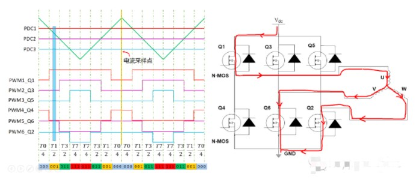

这张图适合先建立整体感觉：一个中心对齐 PWM 周期里，不同 T 状态依次出现；每个状态下 MOS 组合不同，电流路径也不同。

读它时不要先背颜色，而是按顺序看：

```text
当前处于哪个 T 状态
  -> 哪几个 MOS 被驱动
  -> 电流走上管、下管还是二极管
  -> 哪些低边电阻在真实电流路径里
  -> ADC 点能不能放在这个状态中间
```

### 17.2 有效矢量中的稳定路径

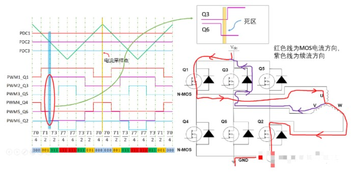

这类图说明“有效矢量中间为什么适合采样”。当主电流路径清楚、下管稳定承载电流时，低边电阻电压更接近真实相电流。

对采样来说，重点不是这张图属于哪个扇区，而是：

```text
有没有两个下管稳定导通？
ADC 点是否离左右边沿足够远？
这个状态能不能提供两相独立电流？
```

### 17.3 Q3/Q6 换流死区

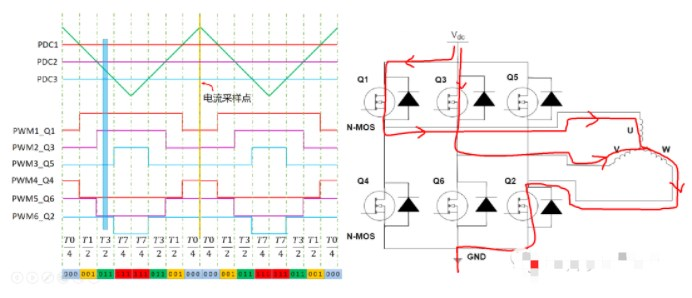

这张图展示某一桥臂上下管换流。死区原则是先关后开，避免上下桥臂直通。

死区内的电流仍然会流，但可能通过体二极管或寄生路径：

```text
下管已经关
上管还没开
电流经二极管续流
采样电阻电压不再简单等于相电流 * 电阻
```

所以边沿和死区附近不适合作为 ADC 主采样点。

### 17.4 Q5/Q2 换流死区

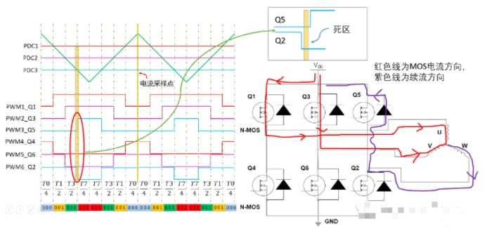

这是另一相桥臂的同类问题。它提醒我们：电流有没有流，不等于低边电阻上的电压就一定适合作为反馈。死区和续流路径会改变“电流经过哪里”。

采样判断仍然是：

```text
避开换流瞬间
避开体二极管主导的短暂路径
选择 MOS 稳定导通后的窗口中部
```

### 17.5 零矢量状态

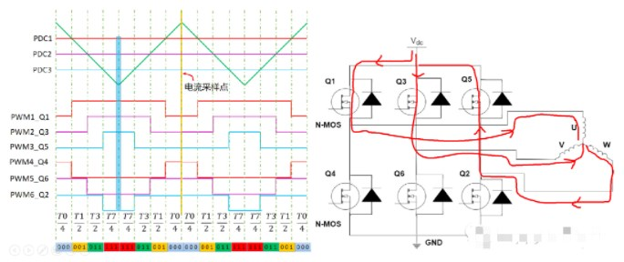

零矢量常出现在中心对齐 SVPWM 的两端或中间，用来对称分配有效矢量时间。

要注意：

```text
零矢量不表示电流为 0。
电机电感会让电流继续流。
000 时三下管理论上都导通，可能采 U/V/W。
但 000 属于零矢量，电流斜率和有效矢量不同。
```

所以 `000` 可以作为辅助采样或诊断窗口，但当前阶段不建议直接把 `000` 和有效矢量采样无条件平均作为主控制电流。

### 17.6 Q2/Q5 换流死区

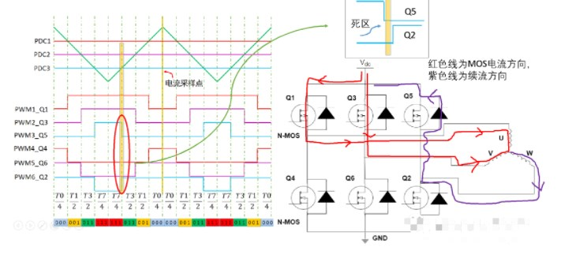

这是从零矢量或相邻有效矢量切换出来的边沿。它和前面的死区图共同说明：同一相从上到下、从下到上，续流器件可能不同。

如果后续做上升计数段和下降计数段双采样，不能只凭“中心对齐对称”就认为两个点完全等价。还要看电流方向和续流路径。

### 17.7 Q6/Q3 换流死区

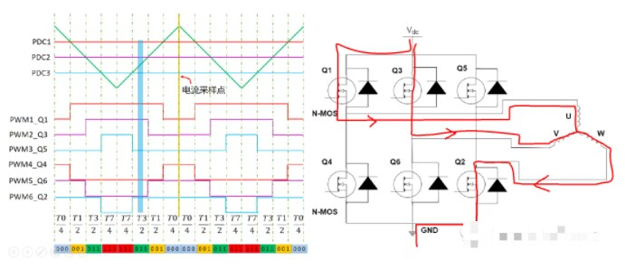

这张图是另一方向的 Q6/Q3 换流。它补充说明：同一桥臂的两个切换方向，死区中的电流路径可能不同。

对当前文档的结论是：

```text
采样点不要贴着任何开关边沿。
上升计数段可以采，下降计数段也可以采。
工程上选哪一段，取决于采样窗口、ADC 转换时间和控制节拍。
```

### 17.8 Q4/Q1 换流死区

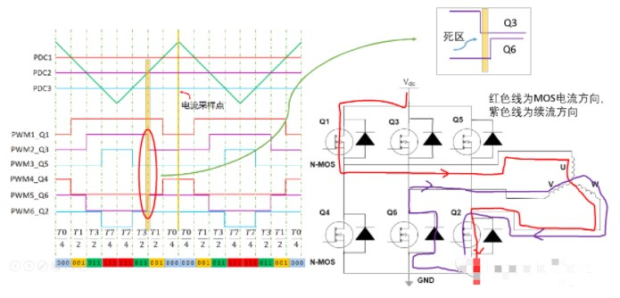

这张图发生在 U 相桥臂附近，对当前工程很有帮助。

当前工程用 `EPWM0 CMP0` 产生 ADC 触发时间点，但 ADC 实际采哪几相由 `CURRENT_ADC_CH_MASK` 决定。

```text
触发源：EPWM0 CMP0 falling
当前采样通道：ADC_CH_2 / ADC_CH_3
当前物理相：V / W
```

所以不要把“触发源来自 U 相 EPWM0”误解成“ADC 一定采 U 相”。EPWM0 在这里首先是一个可靠的时间基准。

### 17.9 其他状态示例

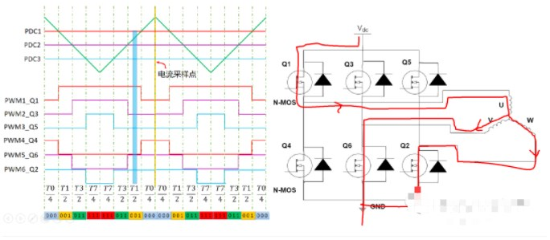

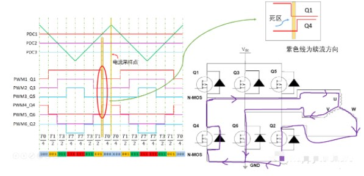

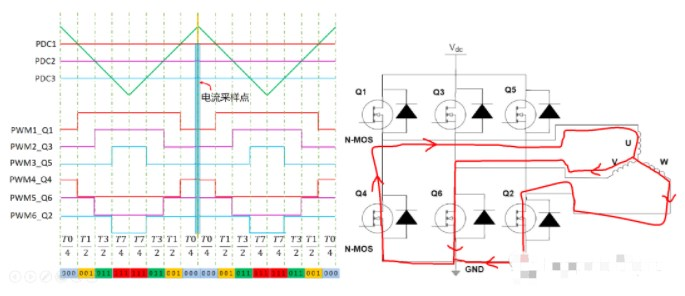

这些图说明第一扇区后半段还有更多状态和续流路径。它们共同强调一件事：

```text
同一扇区内，MOS 导通组合会随 T0/T1/T2/T7 推进而变化。
同一 PWM 周期内，既有有效矢量窗口，也有零矢量窗口，也有死区。
采样点必须落在“可测窗口”，不能只看有三个采样电阻。
```

## 18. 和 ODrive / SimpleFOC 思路怎么对照

不要把任何库简单理解成“只在下降沿采”或“只在 000 采三相”。更准确的共同原则是：

```text
PWM 同步 ADC
避开开关边沿
采低边可测窗口
两相或三相结果送进 FOC
```

典型两路低边采样，例如 ODrive v3 一类思路，和当前工程相似的地方是：

```text
同步采两相
第三相重构
```

SimpleFOC 低边采样文档中常讲的三相低边采样，更接近在所有低边导通的窗口采样。

但无论哪种，本质都不是：

```text
主循环随便读 ADC
贴着 PWM 边沿采
看见方波边沿就采
```

而是：

```text
用 PWM 定时器给 ADC 一个确定的、可重复的采样时间点。
```

当前工程已经做到 PWM 同步 ADC；后续优化点是让同步点更聪明。

## 19. 后续优化路线

当前路线：

```text
固定 CMP0=650
固定采 V/W
U 由当前 logic 映射重构
```

推荐后续按这个顺序推进：

```text
1. 示波器确认 EPWM0/2/4、EPWM1/3/5 真实极性和死区。
2. 确认 CMP0=650 相对 PWM 边沿的位置。
3. 用 JScope 看 raw V/W、logic Iu/Iv/Iw、id/iq、duty 是否自洽。
4. 调整 CMP0 tick，找噪声更低、响应更合理的位置。
5. 再考虑按扇区动态选择 UV/UW/VW。
6. 最后考虑同一稳定窗口内多点采样均值。
```

不要跳过第 1 到第 4 步直接做动态采样。动态策略建立在“单点窗口已经知道怎么判断好坏”的基础上。

## 20. 快速问答

**PWM 开关不是方波吗，怎么合成马鞍波？**

MOS 输出就是方波。马鞍波是很多个 PWM 周期的 duty 包络，不是瞬时 MOS 波形。

**一个 PWM 周期会经过几个扇区？**

通常只处于一个当前扇区内。一个电角周期 360 度才经过 6 个扇区。

**一个 60 度扇区里 duty 要保持不变吗？**

不是。扇区编号一段时间内不变，`duty_u/v/w` 仍然每个 PWM 周期更新。

**为什么低边采样不是任意时刻都有效？**

因为低边电阻只有在对应下管稳定承载电流时才可信。死区、边沿、体二极管续流、振铃都会污染采样。

**为什么常说下降沿采样？**

当前工程是下降计数段 CMP0 触发 ADC，不是贴着 PWM 方波下降边沿采样。下降计数段常被选中，是因为控制节拍容易安排，采样后还有时间计算下一周期输出。

**U 要在哪里采？**

U 下管稳定导通时才能直接采 U。更推荐在 `010` 或 `001` 这类两下管稳定导通的有效矢量窗口采 U；如果当前窗口是 `100`，就采 V/W，U 重构。

**`000` 能不能采三相？**

理论上可以，因为三下管都导通。但 `000` 是零矢量，电流斜率和有效矢量不同。当前阶段更适合作为辅助诊断，不建议直接和有效矢量采样无条件平均。

**当前固定 V/W 和两路低边采样是不是一样？**

大框架很像：PWM 同步采两相，第三相重构。区别是当前硬件有三路采样，后续可以升级到按扇区动态选 `UV/UW/VW`。

**为什么 ADC 通道 U/V/W 和 logic Iu/Iv/Iw 不对应，id/iq 反而可能对？**

因为三相循环换名等价于坐标系整体旋转。如果电流映射、SVPWM 输出相序、电角度零点三者一起自洽，`id/iq` 仍可能落在正确轴上。不要只按相名判断 FOC 坐标是否正确。

**动态采样和取均值能融合吗？**

能。优先做“按扇区选对稳定窗口”，再在同一窗口内多点均值。跨 `100` 和 `000` 这类不同矢量状态的平均要先诊断，再小心融合。

## 21. 一句话收束

```text
SVPWM 决定每个 PWM 周期的三相 duty；
互补 PWM 把 duty 变成上下桥臂安全切换的方波；
电机电感把高速方波平均成连续电流；
低边采样只在下管电流路径稳定时可信；
当前工程已做到 PWM 同步 ADC，但采样策略仍是固定 CMP0 + 固定 V/W；
raw 物理相名、logic 控制相名和 dq 坐标自洽性不能混为一谈；
后续优化方向是按扇区找稳定窗口，再考虑窗口内多点均值。
```
